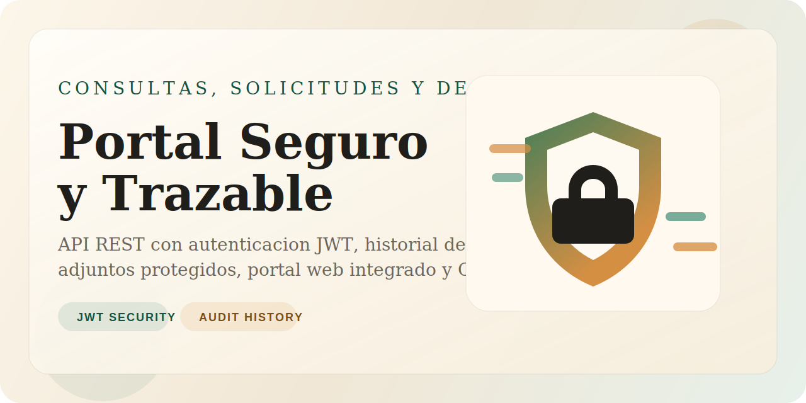

# PROYECTO ADSO 2

[](https://github.com/alexriver101219/PROYECTO-ADSO-2/actions/workflows/ci.yml)
[](https://github.com/alexriver101219/PROYECTO-ADSO-2/actions/workflows/docker-publish.yml)



API y portal web para consultas, solicitudes y descargas, construido con `Node.js`, `TypeScript`, `Fastify`, `Prisma` y `SQLite`.

## Resumen

Este proyecto centraliza el ciclo completo de solicitudes de usuario:

- autenticacion segura con JWT
- gestion de solicitudes con trazabilidad
- control de estados por rol
- adjuntos protegidos y descargables
- portal web integrado
- automatizacion CI y publicacion de imagen Docker

## Caracteristicas

- Registro e inicio de sesion con JWT
- Roles `USER` y `ADMIN`
- Creacion y consulta de solicitudes
- Historial de cambios de estado
- Carga y descarga de adjuntos
- Portal web integrado
- Documentacion Swagger
- Coleccion Postman lista para importar
- Pruebas automatizadas con Vitest

## Stack

- Backend: `Fastify` + `TypeScript`
- Base de datos: `SQLite`
- ORM: `Prisma`
- Auth: `@fastify/jwt`
- Uploads: `@fastify/multipart`
- Testing: `Vitest` + `Supertest`
- Contenedores: `Docker`
- CI/CD: `GitHub Actions`

## Estructura

```text
src/
  config/
  lib/
  main/
  modules/
public/
postman/
prisma/
tests/
```

## Requisitos

- Node.js 20+
- npm
- Docker opcional para despliegue por contenedor

## Configuracion

1. Instala dependencias:

```bash
npm install
```

2. Crea tu archivo de entorno:

```bash
copy .env.example .env
```

3. Prepara el admin inicial:

```bash
npm run db:seed
```

## Uso rapido

```bash
npm install
copy .env.example .env
npm run db:seed
npm start
```

## Ejecucion

Modo desarrollo:

```bash
npm run dev
```

Modo compilado:

```bash
npm run build
npm start
```

## URLs

- Portal: `http://127.0.0.1:3000/`
- Swagger: `http://127.0.0.1:3000/docs`
- Health: `http://127.0.0.1:3000/health`

## Credenciales demo

- Email: `admin@example.com`
- Password: `Admin123!`

## Scripts

```bash
npm run build
npm run dev
npm start
npm test
npm run db:seed
npm run prisma:generate
```

## Docker

Construccion local:

```bash
docker build -t proyecto-adso-2 .
docker run -p 3000:3000 --env-file .env proyecto-adso-2
```

Publicacion automatica:

- El workflow `Publish Docker Image` publica una imagen en `ghcr.io/alexriver101219/proyecto-adso-2`
- Se ejecuta automaticamente en cada push a `main`

## Postman

Importa estos archivos:

- `postman/consultas-api.postman_collection.json`
- `postman/consultas-api.local.postman_environment.json`

## Flujo principal

1. Registrar o iniciar sesion
2. Crear una solicitud
3. Consultar el listado y el detalle
4. Cambiar estado segun el rol
5. Subir adjuntos como admin
6. Descargar adjuntos como usuario autorizado o admin

## Testing

```bash
npm test
```

## Estado

Proyecto funcional con backend, frontend basico, coleccion Postman, CI con GitHub Actions y publicacion de imagen Docker.
